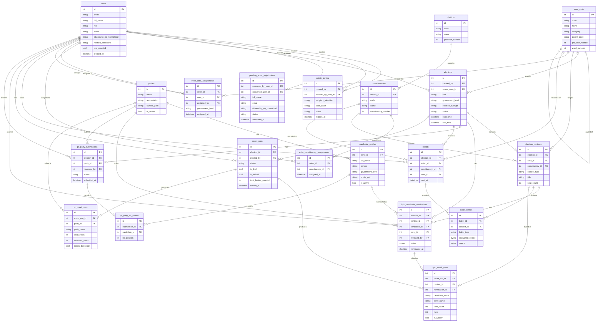

# Database Schema

```mermaid
erDiagram

    users {
        int id PK
        string email
        string full_name
        string role
        string status
        string citizenship_no_normalized
        string hashed_password
        bool totp_enabled
        datetime created_at
    }

    admin_invites {
        int id PK
        int created_by FK
        int revoked_by_user_id FK
        string recipient_identifier
        string code_hash
        string status
        datetime expires_at
    }

    pending_voter_registrations {
        int id PK
        int approved_by_user_id FK
        int converted_user_id FK
        string full_name
        string email
        string citizenship_no_normalized
        string status
        datetime submitted_at
    }

    districts {
        int id PK
        string code
        string name
        int province_number
    }

    constituencies {
        int id PK
        int district_id FK
        string code
        string name
        int constituency_number
    }

    area_units {
        int id PK
        string code
        string name
        string category
        string parent_code
        int province_number
        int ward_number
    }

    voter_constituency_assignments {
        int id PK
        int voter_id FK
        int constituency_id FK
        datetime assigned_at
    }

    voter_area_assignments {
        int id PK
        int voter_id FK
        int area_id FK
        int assigned_by FK
        string government_level
        datetime assigned_at
    }

    elections {
        int id PK
        int created_by FK
        int scope_area_id FK
        string title
        string government_level
        string election_subtype
        string status
        datetime start_time
        datetime end_time
    }

    election_contests {
        int id PK
        int election_id FK
        int area_id FK
        int constituency_id FK
        string contest_type
        string title
        int seat_count
    }

    parties {
        int id PK
        string name
        string abbreviation
        string symbol_path
        bool is_active
    }

    candidate_profiles {
        int id PK
        int party_id FK
        string full_name
        string gender
        string government_level
        string photo_path
        bool is_active
    }

    fptp_candidate_nominations {
        int id PK
        int election_id FK
        int contest_id FK
        int candidate_id FK
        int party_id FK
        int reviewed_by FK
        string status
        datetime nominated_at
    }

    pr_party_submissions {
        int id PK
        int election_id FK
        int party_id FK
        int reviewed_by FK
        string status
        datetime submitted_at
    }

    pr_party_list_entries {
        int id PK
        int submission_id FK
        int candidate_id FK
        int list_position
    }

    ballots {
        int id PK
        int election_id FK
        int voter_id FK
        int constituency_id FK
        int area_id FK
        datetime cast_at
    }

    ballot_entries {
        int id PK
        int ballot_id FK
        int contest_id FK
        string ballot_type
        bytes encrypted_choice
        bytes nonce
    }

    count_runs {
        int id PK
        int election_id FK
        int created_by FK
        string status
        bool is_final
        bool is_locked
        int total_ballots_counted
        datetime started_at
    }

    fptp_result_rows {
        int id PK
        int count_run_id FK
        int contest_id FK
        int nomination_id FK
        string candidate_name
        string party_name
        int vote_count
        int rank
        bool is_winner
    }

    pr_result_rows {
        int id PK
        int count_run_id FK
        int party_id FK
        string party_name
        int valid_votes
        int allocated_seats
        bool meets_threshold
    }

    %% ── Users ───────────────────────────────────────────
    users ||--o{ admin_invites : "creates"
    users ||--o{ admin_invites : "revokes"
    users ||--o{ pending_voter_registrations : "approves"
    users ||--o{ elections : "creates"
    users ||--o{ voter_constituency_assignments : "assigned to"
    users ||--o{ voter_area_assignments : "assigned to"
    users ||--o{ voter_area_assignments : "assigns"
    users ||--o{ ballots : "casts"
    users ||--o{ count_runs : "runs"
    users ||--o{ fptp_candidate_nominations : "reviews"
    users ||--o{ pr_party_submissions : "reviews"

    %% ── Geography ───────────────────────────────────────
    districts ||--|{ constituencies : "contains"
    constituencies ||--o{ voter_constituency_assignments : "assigned in"
    constituencies ||--o{ election_contests : "scopes"
    constituencies ||--o{ ballots : "recorded on"
    area_units ||--o{ area_units : "parent of"
    area_units |o--o{ elections : "scopes"
    area_units ||--o{ election_contests : "targets"
    area_units ||--o{ voter_area_assignments : "assigned in"
    area_units |o--o{ ballots : "recorded on"

    %% ── Elections ───────────────────────────────────────
    elections ||--|{ election_contests : "contains"
    elections ||--o{ fptp_candidate_nominations : "has"
    elections ||--o{ pr_party_submissions : "has"
    elections ||--o{ ballots : "receives"
    elections ||--o{ count_runs : "counted in"

    %% ── Contests ────────────────────────────────────────
    election_contests ||--o{ fptp_candidate_nominations : "has"
    election_contests ||--o{ ballot_entries : "receives"
    election_contests ||--o{ fptp_result_rows : "tallied in"

    %% ── Parties & Candidates ────────────────────────────
    parties ||--o{ candidate_profiles : "has"
    parties ||--o{ fptp_candidate_nominations : "under"
    parties ||--o{ pr_party_submissions : "submits"
    parties ||--o{ pr_result_rows : "tallied in"
    candidate_profiles ||--o{ fptp_candidate_nominations : "nominated as"
    candidate_profiles ||--o{ pr_party_list_entries : "listed in"

    %% ── PR Submissions ──────────────────────────────────
    pr_party_submissions ||--|{ pr_party_list_entries : "contains"

    %% ── Ballots ─────────────────────────────────────────
    ballots ||--|{ ballot_entries : "contains"

    %% ── Results ─────────────────────────────────────────
    fptp_candidate_nominations ||--o{ fptp_result_rows : "tallied as"
    count_runs ||--o{ fptp_result_rows : "produces"
    count_runs ||--o{ pr_result_rows : "produces"
```
